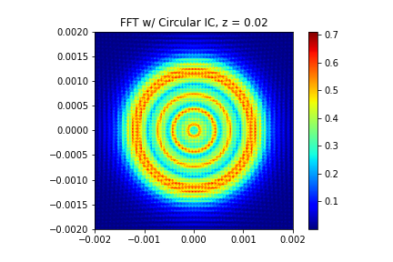
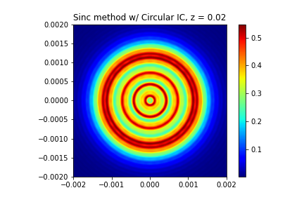

# Fresnel Diffraction Integral

This code focuses on solving the Helmholtz Paraxial equation, a slowly-varying envelope function for monochromatic waves and short-range approximation to the general wave equation. The solution to the Helmholtz Paraxial equation is known as the Fresnel Diffraction approximation. 

Below is a brief overview of the two methods while a more in depth overview, derivations and references can be found in the [writup](Fresnel_Diffraction_writeup.pdf) and [presentation](Fresnel_diffraction_presentation.pptx). 

## Formulation 
We are looking to solve the Helmholtz Paraxial equation, 
$$(2ik\partial_z + \nabla_T^2)\psi(\boldsymbol{r}) = 0$$
Where $k = 2\pi/\lambda$ is the wave number given wavelength $\lambda$, and $\nabla_T^2$ is the transverse laplacian given by $\partial_x^2 + \partial_y^2$ and the solution is known as the Fresnel Diffraction Approximation or integral, 
$$U(X,Y) = \frac{-ike^{ikz}}{2\pi z}\int_{-\infty}^\infty\int_{-\infty}^\infty e^{\frac{ik}{2z}((X-x)^2 + (Y-y)^2)}u(x,y) dx dy$$
where $u(x,y)$ is the initial source and $U(X,Y)$ is the solution at a plane at distance $z$. 

## Spectral Method
    
We first note we can write the Fresnel Diffraction Approximation in terms of a convolution. Let the Fresnel kernel be denoted as, 
$$h_F(x,y) = \frac{-ike^{ikz}}{2\pi z}e^{\frac{ik}{2z}(x^2 + y^2)}$$
where, 
$$U(X,Y) = (h_F\star u)(X,Y) = \frac{-ike^{ikz}}{2\pi z}\int_{-\infty}^\infty\int_{-\infty}^\infty e^{\frac{ik}{2z}((X-x)^2 + (Y-y)^2)}u(x,y) dx dy$$
Now recalling the convolution theorem, 
$$\mathcal{F}(h_F\star u)(\xi,\eta) = \hat{h_F}(\xi,\eta)\hat{u}(\xi,\eta)$$
where the Fourier transform of the Fresnel kernel is,
$$\hat{h_f}(\xi,\eta) = e^{ikz}\exp\left(\frac{-i2\pi^2z}{k}(\xi^2+\eta^2)\right)$$
The solution using the inverse Fourier Transform is thus,
$$U(X,Y) = \mathcal{F}^{-1}[\hat{h_F}\hat{u}]
 = e^{ikz}\int_{-\infty}^\infty \int_{-\infty}^\infty \exp\left(\frac{-i2\pi^2z}{k}(\xi^2+\eta^2)\right)\hat{u}(\xi,\eta) e^{i2\pi(X\xi + Y\eta)}d\xi d\eta$$
As the spectral method approximates the inverse Fourier Transform by the composite trapezoidal rule, $U(X,Y)$ is computed as, 
$$U(X,Y) \approx e^{ikz}\frac{1}{L^2}\sum_{m = -L/2}^{L/2} \sum_{n = -L/2}^{L/2}  \exp\left(\frac{-i2\pi^2z}{k}(\xi_m^2+\eta_n^2)\right)\hat{u}(\xi_m,\eta_n) e^{i2\pi(X\xi_m + Y\eta_n)}d\xi d\eta$$

Where we can see artificial boundary conditions are imposed and waved reaching the boundary are reintroduced rather than dispersed through infinity. 

## Sinc Based Method

The Sinc based method relies on the Shannon-Whittaker sampling theorem. Let $f(x)$ be a band limited function (chopping off the initial condition where we want it to be true 0 outside a certain domain). 
Then $f$ can be represented exactly by,
$$f(x) = \sum_{n=-\infty}^\infty f_n \textnormal{ sinc} \left( \frac{x - x_n}{\Delta x}\right)$$
where $x_n = n \Delta x, f_n = f(x_n)$. Thus we can rewrite our initial condition as (first truncating the series for computation), 
$$u(x,y) = \sum_{m=-{N/2}}^{N/2}\sum_{n=-{N/2}}^{N/2} u_{mn} \textnormal{ sinc}\left( \frac{x - x_m}{\Delta x}\right) \textnormal{ sinc}\left( \frac{y - y_n}{\Delta y}\right)$$
The solution the Helmholtz Paraxial equation is given by the convolution with the Fresnel kernel $h_f$, 
$$U(X,Y) = \sum_{m=-{N/2}}^{N/2}\sum_{n=-{N/2}}^{N/2} u_{mn} \left(h_f \star (\textnormal{ sinc}\left( \frac{x - x_m}{\Delta x}\right) \textnormal{ sinc}\left( \frac{y - y_n}{\Delta y}\right))\right)(X,Y)$$

To generalize the right hand side (let us assume $\delta = \Delta x,\Delta y$) and let, 
$$\Phi(X,Y) = \int_{-\infty}^\infty\int_{-\infty}^\infty h_f(X - x,Y-y)\textnormal{ sinc}(\frac{x}{\delta})\textnormal{ sinc}(\frac{y}{\delta})dxdy$$

Where we use the convolution property of the Fourier Transform  and the fact that the Transform of a sinc function,
$$\mathcal{F} \left[ \textnormal{ sinc}(\frac{x}{\delta}) \right] (\xi) = \delta \textnormal{ rect}(\delta \xi )$$

Giving us the inverse Fourier transform vanishes outside of the square $-\frac{1}{2}$  $\leq \xi \delta \leq \frac{1}{2}$,$-\frac{1}{2}\leq \eta\delta \leq \frac{1}{2}$ thus let $W = \frac{1}{2\delta}$ then, 

$$\Phi(X,Y) = \delta^2 \int_{-W}^W\int_{-W}^W \hat{h}_f(\xi,\eta)e^{i2\pi(X\xi + Y\eta)}d\xi d\eta$$

Which we can be accurately computed on a chosen domain. We can now rewrite our solution as, 
$$U(X,Y) = \sum_{n = -{N/2}}^{{N/2}}\sum_{m = -{N/2}}^{N/2} u_{nm} \Phi(X - x_n,Y-y_m)$$
We can see clearly now the sinc based method never assumes periodic boundary conditions. Thus the numerical solution will only depend on the fineness of the grid rather than the is propagation distance, wavelength, and observation plane discretization. Further, A numerically efficient method for computing the solution and integrals above was solved writing the solution in terms of matrix multiplications for in [] and can be found in [writeup] and code. 

## Findings: 
In the case of the Fresnel Diffraction Approximation we found the FFT based method introduces artificial periodic boundary conditions and the accuracy of the algorithm depends on propagation distance, wavelength, and observation plane discretization whereas the sinc based method relies on only how well the source field (initial condition) is approximated. 

 